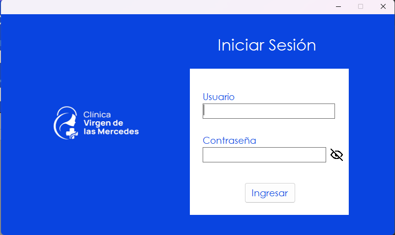
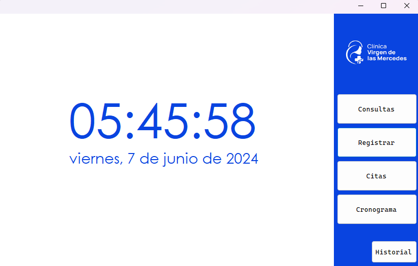
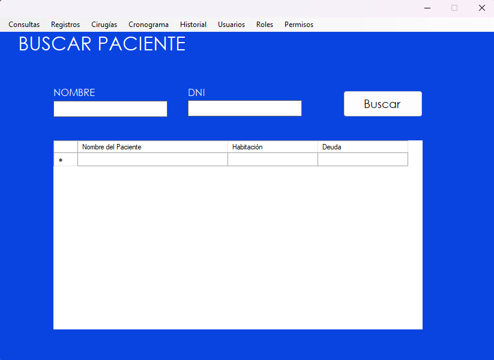

# Sistema-Medico
Sistema creado a fin de solucionar los principales problemas de la Clinica Virgen de las Mercedes - Tarapoto

**Hecho con formulario de Visual Studio 2022 (.Net Framework)**

## 🧞 Caracteristicas Fundamentales

**ENFOCADO EN EL AREA DE HOSPITALIZACION**

| Actor                       | Acción                                                |
| :-------------------------- | :---------------------------------------------------- |
| `Recepcionista`             | Consultar ubicación del paciente y su estado          |
| `Medico`                    | Programar citas para cirugía                          |
| `Administrador`             | Supervizar las actividades                            |
| `Personal de Mantenimiento` | Consultar lugar, fecha y hora de las proximas Hospitalizaciones   |
| `Licenciado de Enfermería`            | Registrar ingreso, salida e información de los pacientes hospitalizados |

**Esta aplicación no es oficial**
Hecho para el curso de Modelamiento y Analisis de Software - **Universidad Privada del Norte**

